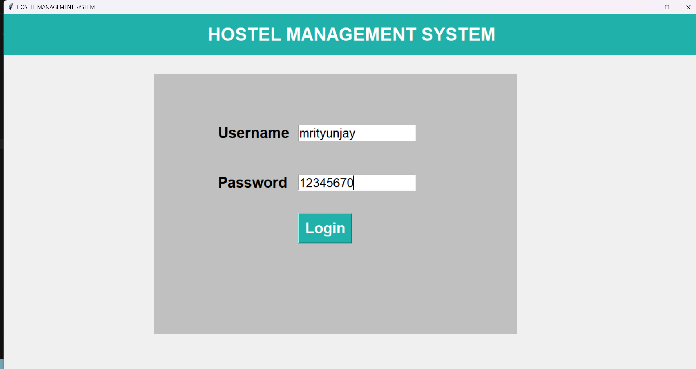
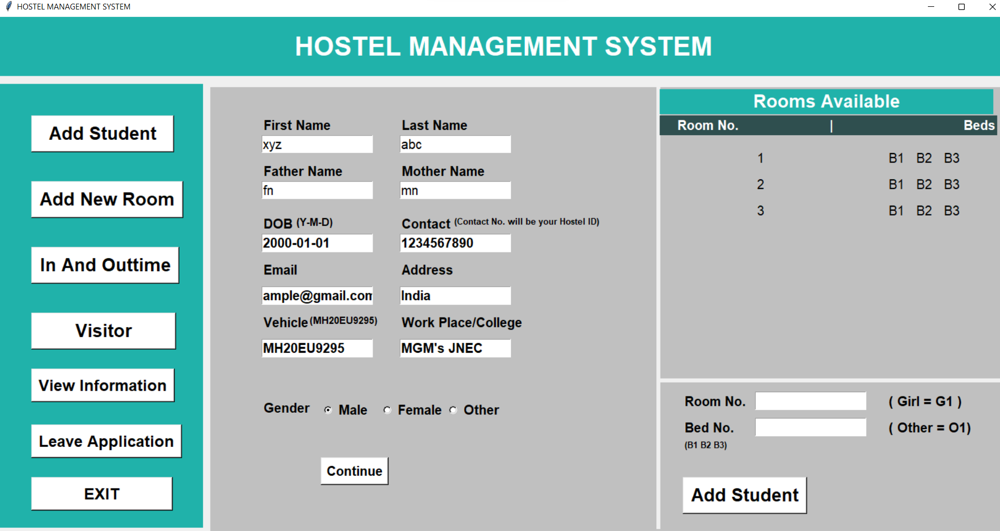
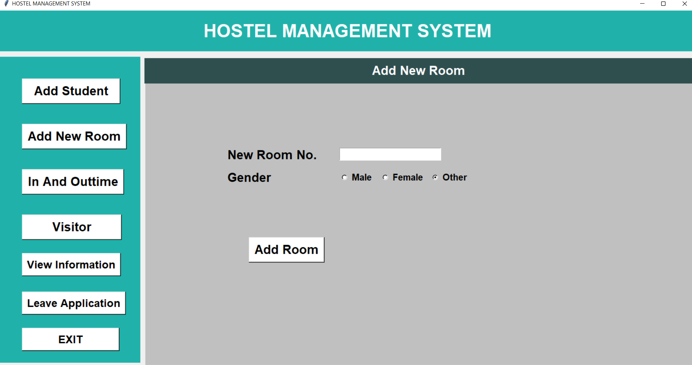
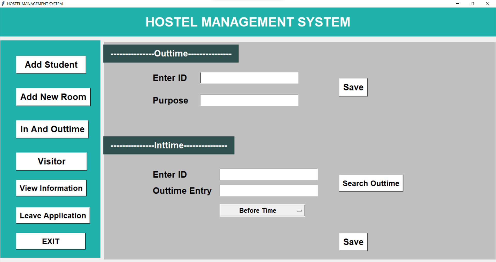
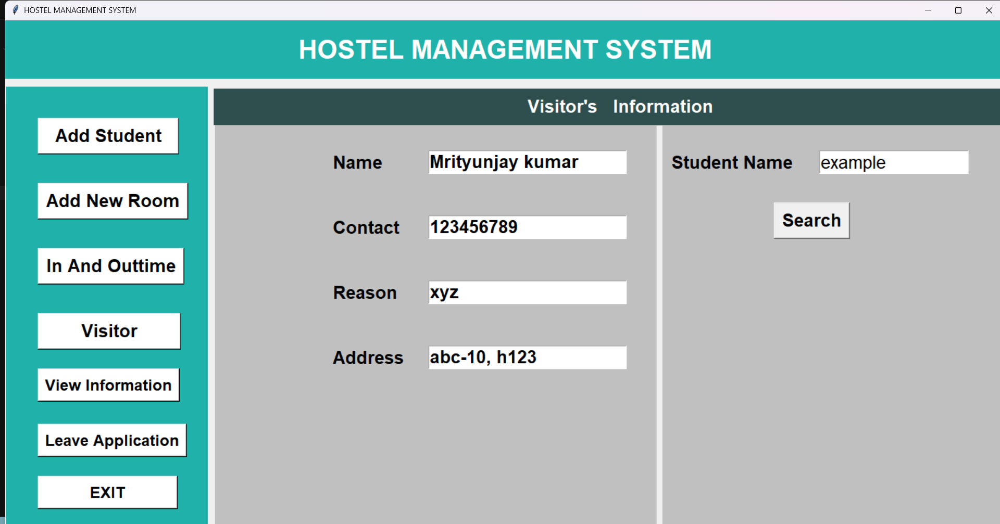
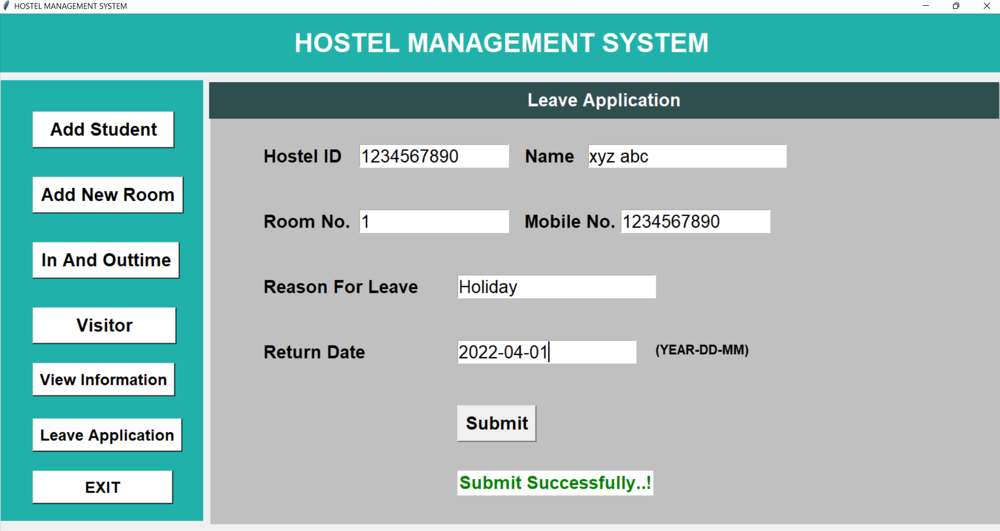

## Hostel Management System
A comprehensive Hostel Management System built with Python Tkinter and MySQL database. It manages students, rooms, visitors, in/out time logs, and leave applications with robust data persistence.

### Requirements
- Python 3.8+
- MySQL Server 5.7+ or 8.0+
- Tkinter (bundled with standard Python on Windows/macOS; on some Linux distros install via your package manager)
- Required Python packages (see requirements.txt)

### Project Structure
- `Hostel Management.py`: Main GUI application
- `database_config.py`: Database connection configuration
- `database_operations.py`: Database operations and queries
- `database_schema.sql`: MySQL database schema
- `setup_database.py`: Database initialization script
- `Images/`: Screenshots used in this README

### Quick Setup & Run
1. **Install Dependencies**:
   ```bash
   pip install -r requirements.txt
   ```

2. **Setup MySQL Database**:
   - Install MySQL Server on your system
   - Create a database user (or use root)
   - Update database credentials in `database_config.py` if needed
   - Run the database schema:
   ```bash
   mysql -u root -p < database_schema.sql
   ```

3. **Test Database Connection**:
   ```bash
   python database_config.py
   ```

4. **Start the app**:
   - Windows: Right‑click `Hostel Management.py` → Open with Python
   - Or from terminal: `python "Hostel Management.py"`

### Default Login
- Username: `mrityunjay`
- Password: `12345670`

These values are hardcoded in `Hostel Management.py` inside the `login()` function.

### Change the Login Credentials
1. Open `Hostel Management.py`.
2. Find the `login()` function near the bottom.
3. Replace the two string literals in the condition with your desired username and password, e.g.:

```python
if id == "YourUsername" and key == "YourPassword":
    main()
```

Optional (slightly safer): move them to module‑level constants or read from an environment file to avoid editing code for future changes.

### Core Features
- Add Student: Register student details and assign a specific bed in a room
- Add New Room: Create rooms for Boys/Girls/Others with three beds each (e.g., B1/B2/B3)
- In/Out Time: Log outtime and subsequently record the corresponding intime with a remark (Before Time/On Time/Late)
- Visitor: Record visitor details for a student
- View Information: List all students or search by room number
- Leave Application: Submit and store leave requests

### Database Schema
The system uses MySQL with the following main tables:
- **rooms**: Room information with bed allocation status
- **students**: Student details and room assignments
- **inouttime**: In/out time logging with remarks
- **visitors**: Visitor information linked to students
- **leave_applications**: Leave application submissions
- **admin_users**: Admin authentication (currently using hardcoded credentials)

### Database Features
- **ACID Compliance**: All operations are atomic and consistent
- **Data Integrity**: Foreign key constraints ensure data relationships
- **Scalability**: Can handle large numbers of students and records
- **Backup & Recovery**: Standard MySQL backup procedures apply
- **Performance**: Indexed columns for fast queries

### Tips
- Create rooms first so that beds are available to assign when adding students
- The contact number acts as the Hostel ID during student registration
- If you see "No Rooms Available," add rooms for the selected gender
- Database connection errors will be displayed in the UI for troubleshooting

### Screenshots












